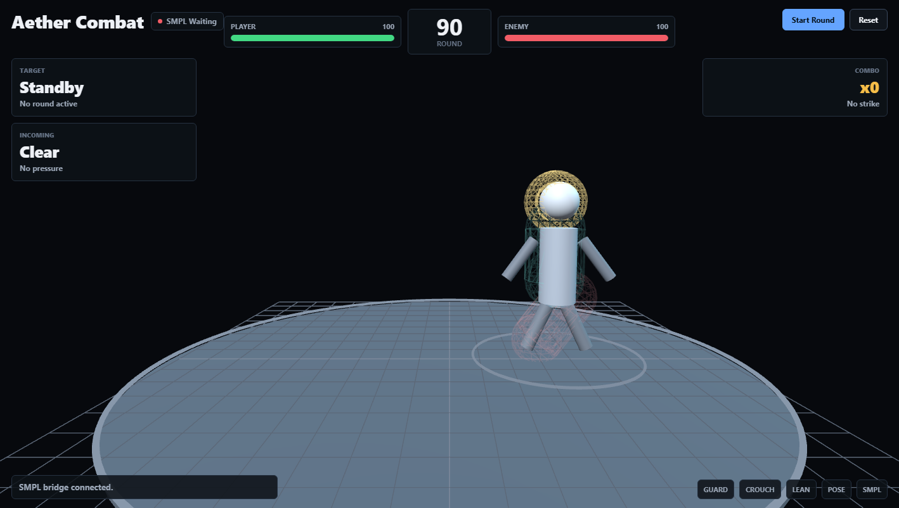

# Aetherpose Web UI

瀏覽器版的 Aetherpose 主控介面：左邊是即時 3D 人體（SMPL 網格與骨架），右邊是分頁式控制面板。

| 分頁 | 功能 |
|---|---|
| Calibration | 追蹤器清單、Auto Assign、Reset Mounting、Reset Yaw |
| Monitor | 各追蹤器的訊號與電量 |
| Body | 身體比例、平滑濾波、虛擬地板、漂移與軌跡、腿部校正 |
| System | OSC、ZUPT、錄製、Serial |
| **Combat** | **Aether Combat 模式**：用身上的 IMU 跟對手機器人對打 |

## 資料流

```
IMU 追蹤器 ──BLE──> aetherpose.exe ──ws :9009──> 控制面板（追蹤器、校正、設定）
                         │
                         └──ws :9009──> frontend/mesh_bridge.py ──ws :9010──> 3D 人體 / Combat 模式
                                         (TransPose 推論)
```

頁面只開**一條** mesh_bridge 連線，同一份身體資料同時提供給控制畫面和 Combat 模式。

## 啟動

在 `aetherpose/webui` 執行：

```powershell
.\run.ps1           # 開啟主控介面  http://127.0.0.1:18080/
.\run.ps1 -Combat   # 直接進入 Combat 模式  http://127.0.0.1:18080/#combat
```

桌面程式（`frontend/main.py`）的 **Apps** 分頁按「Open Aether Combat」，執行的就是 `run.ps1 -Combat`。

腳本只會啟動**還沒在跑**的服務：

| 服務 | 埠 | 記錄檔 |
|---|---|---|
| Rust 後端 `aetherpose.exe` | 9009 | `aetherpose/backend_run_stderr.log` |
| `frontend/mesh_bridge.py` | 9010 | `aetherpose/frontend/mesh_bridge_stderr.log` |
| 網頁伺服器（本資料夾） | 18080 | `webui/http_server.err.log` |

選項：`-Port 18090` 換網頁埠，`-NoBrowser` 不自動開瀏覽器。服務都在背景執行，關閉用：

```powershell
.\stop.ps1               # 關閉網頁伺服器、mesh_bridge、後端
.\stop.ps1 -KeepBackend  # 保留後端
```

## Combat 模式



在 Combat 分頁（或網址加 `#combat`）時，3D 區域換成擂台，在上方工具列按 Start Round 開始一回合（90 秒）。

- **攻擊**：出拳（手快速揮出、高度至少到胸口）或踢腿（腳快速離地），打中亮起的部位：頭、身體或腿。
- **防禦**：高位攻擊 → 雙手護頭（Guard）或蹲下；身體攻擊 → Guard；側面攻擊 → 身體往旁邊傾。
- **Recenter** 把你在擂台上的位置重設到中央。
- 離開 Combat 分頁會結束目前的回合；Combat 模式開著時，控制畫面的 3D 會暫停繪製以節省效能。

程式位於 `combat.js`（遊戲邏輯與擂台場景）與 `combat.css`（所有樣式都限定在 `#combat-view` 內，不影響控制介面）。

## 需求與注意事項

- 需先完成 aetherpose 的環境建置（`..\setup.ps1`）：Rust 後端已編譯、上層資料夾有 `.venv`。
- 頁面從 unpkg CDN 載入 three.js，需要網路連線。
- 一顆追蹤器同時只能被一個程式透過 BLE 連線。用 `tools/imu_axes.py` 直連 BLE 測單顆 IMU 時要先關掉它；改用 `--ws ws://127.0.0.1:9009/ws` 則可以跟後端同時使用。
- 追蹤器韌體更新後（例如座標系或濾波器改變），請在 Calibration 分頁重新做 Reset Mounting。
